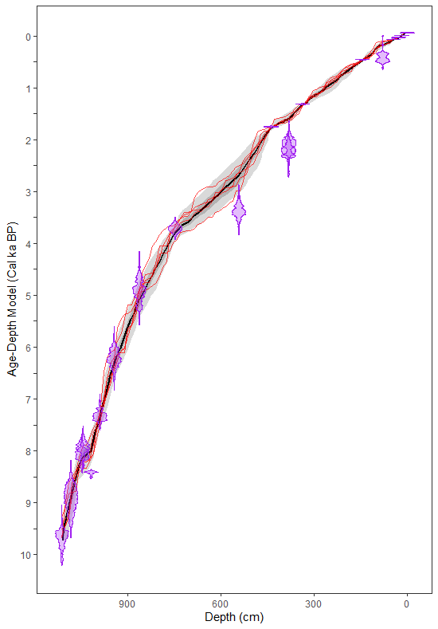

```{r, include = FALSE}
knitr::opts_chunk$set(
  collapse = TRUE,
  comment = "#>"
)
knitr::opts_chunk
knitr::opts_chunk
```

```{r}
library(paleosedr)
library(readxl)
library(purrr)
library(lipdR)
library(geoChronR)
library(ggplot2)
```

Table of Contents

1\. Standardized Data

2\. LIPD Playground

3\. **Age Modeling**

4\. Plotting Sed. Rate and MAR

5\. Plotting Multi-Proxy Records

6\. Particle Size Heatmap

# 3. Age Modeling

Before creating your age model, you will need to have your LipD
Playground file all set and ready to go, with both paleo and chron data
in it.

Once again, we are going to reference the Eklutna dataset. If your
variables and filepath to the LipD file we made are named differently or
saved somewhere else, change them for your own dataset.

```{r}
Eklutna <- lipdR::readLipd("C:/Users/allen/OneDrive/Documents/Rstudio/Rstudio/paleosedr/extdata/eklutna.allen.2024.lpd")
```

The following code will rely on the function runBacon and the geoChronR
package. For tuning your specific age model, I recommend going to this
website. It will help you tune the priors and make your age model fit
the dataset
(<https://nickmckay.github.io/GeoChronR/articles/Introduction.html>). At
Eklutna, we needed to change the sedimentation rate at different core
parts using slump, boundary, and bacon.acc.mean. Every lake and every
record is unique, so you can set it up however you like.

```{r, cache = TRUE}
eklutna_age <- runBacon(Eklutna,
              lab.id.var = 'labID',
              age.14c.var = 'age', 
              age.14c.uncertainty.var = 'age_uncertainty',
              age.var = 'cal_age', 
              age.uncertainty.var = 'minus_error', 
              depth.var = 'depth', 
              reservoir.age.14c.var = NULL, 
              reservoir.age.14c.uncertainty.var = NULL, 
              rejected.ages.var = NULL,
              ask = FALSE,
              bacon.dir = "~/Cores",
              suggest = FALSE,
              close.connection = FALSE,
              d.max = 1115,
              slump = c(18,19, 26.5,27, 30,31, 44.5,45, 144,145, 336,337, 438,439, 747,748),
              postbomb = 1,
              boundary = c(710, 1040),
              bacon.acc.mean = c(7.83,10,20),
              accept.suggestions = TRUE,)
```

Great! You now have a Bayesian age model for Eklutna! Now, lets
visualize the data using the plot_age_model function.

```{r}
eklutna_age_model <- plot_age_model(eklutna_age)
eklutna_age_model
```
If you want to change the axis labels you can re reference your plot and add elements just like a ggplot. I normal do somehting like this, but make sure to change the breaks on both scales depending on your core depth and age:
```{r}
eklutna_age_model <- eklutna_age_model+
  scale_x_reverse(
    breaks = c(10000, 9500, 9000, 8500, 8000, 7500, 7000, 6500, 6000, 5500, 5000, 4500, 4000, 3500, 3000, 2500, 2000, 1500, 1000, 500, 0),
    labels = c("10", "", "9", "", "8", "", "7", "", "6", "", "5", "", "4", "", "3", "", "2", "", "1", "", "0")
  ) +
  scale_y_reverse(
    breaks = c(1150,1100,1050,1000, 950, 900, 850, 800, 750, 700, 650, 600, 550, 500, 450, 400, 350, 300, 250, 200, 150, 100, 50, 0),
    labels = c("","11","", "10", "", "9", "", "8", "", "7", "", "6", "", "5", "", "4", "", "3", "", "2", "", "1", "", "0")
  ) 
eklutna_age_model
```


You should now have an age model plot called eklutna_age_model. This
plot is similar to a ggplot and can be manipulated with those commands
until you get a plot you like. Similar to the depth plots in the last
section, you can adjust the code and axis labels to match your desired
length.



