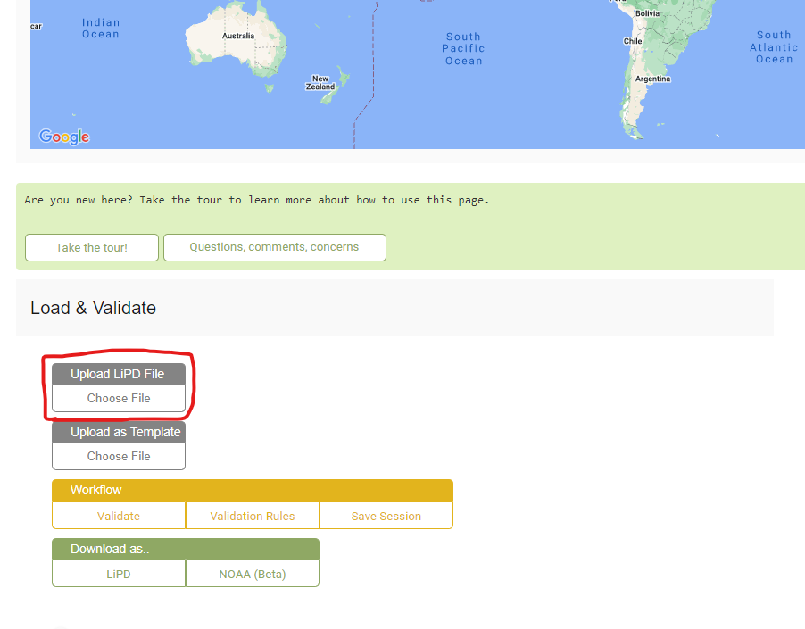
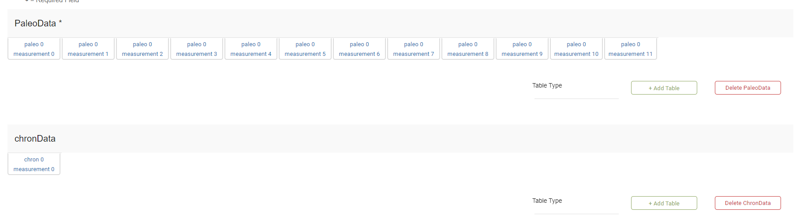
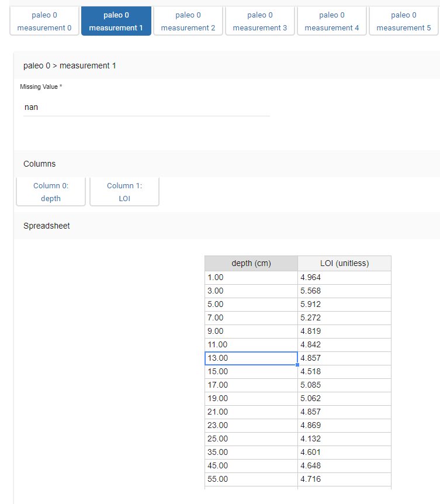
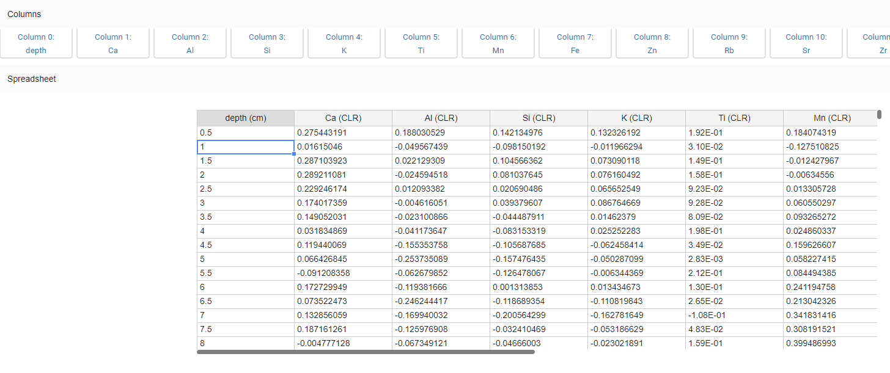
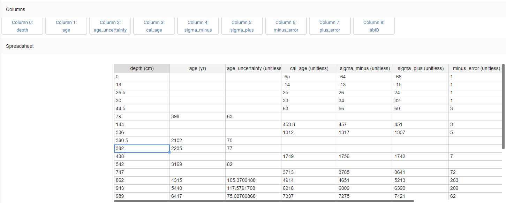

```{r setup, include=FALSE}
knitr::opts_chunk$set(echo = TRUE)
```

Table of Contents 1. Standardized Data 2. **LIPD Playground** 3. Age Modeling 4. Plotting Sed. Rate and MAR 5. Plotting Multi-Proxy Records 6. Particle Size Heatmap

# #2 LipD Playground

LipD is a great package that is essential for plotting and creating age models for this package. I would recommend checking out the lipD website if you are interested in the project and it continued development (<https://github.com/nickmckay/lipdR> and <https://lipdverse.org>).

In this section, I will walk you through the LipD Playground website to set up your age model and ensemble plotting.

Again, you will need some files from Eklutna saved in a directory. Another good tip is using the same LipD file on different projects and changing the data/names of the projects. This will make it easy to copy and paste old code. (<https://drive.google.com/file/d/12BHnxgGWxiBJsc1NWKYoe4K0f8wzy8zI/view?usp=drive_link>)

First, open Lipd Playground using this Link: (<https://lipd.net/playground>).

Here, you will see the main page. You can upload the eklutna.allen.2024 file you just downloaded here: <https://drive.google.com/file/d/1suefK5QUOaCVXpPeKE9Vsvq0OXjjJLpU/view?usp=sharing>



Once uploaded, LipD will now be populated with all the Eklutna datasets formatted for LipD. Again, you can start here for your own lake and copy and paste over the Eklutna data. If you are creating your own file, update the "Dataset Name," "Arcive Type," and "Investigation" sections, as well as any other pertinent information about your lake.

Scroll down, and you will come to the most important part of the LipD playground, the PaleoData and chronData sections.



If you uploaded the Eklutna file, you will see 12 paleotables and 1 chrontable. Each of these paleo measurement tables is one of your datasets from the original Excel file. The example below is Eklutna's LOI dataset! These paleotables are super simple, having just composite depth and the proxy record. They can get more complicated with RABD and XRF data however.



It is okay to have more complex paleotables for XRF and RABD; just make sure each column is clearly labeled, as in the image below. If you have a similar dataset, feel free to copy over the Eklutna data or start from scratch and make a new table altogether.



Next, scroll down to the chronData section. This is where you enter all of your age data! You must know which are radiocarbon, tephra, lead-cesium, or other ages.

Similar to the paleodata tables, this chart will have multiple headers. In the image below, you will notice that age and age_uncertainty have some dates filled in and some not. **THIS IS IMPORTANT: If you are using radiocarbon ages, they must go in the age and age_uncertainty columns and not the cal_age and the following columns!** This is because your age model will calibrate the radiocarbon ages. What you put here are 14C ages that are un-calibrated. The other ages in the table also cannot go into the age and age_uncertainty section because they are not 14C and do not need to be calibrated.

Great! Now that your paleo and chron tables are filled out, go back to the top of the page and download this file somewhere you can reference later in RStudio. To create the age model and time-seieres plots, head to the next section.
