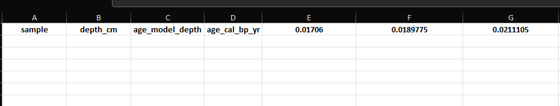

```{r setup, include=FALSE}
knitr::opts_chunk$set(echo = TRUE)
```

```{r}
library(paleosedr)
library(readxl)
library(purrr)
library(lipdR)
library(geoChronR)
library(gridExtra)
library(ggplot2)
```

Table of Contents 1. Standardized Data 2. LIPD Playground 3. Age
Modeling 4. Plotting Sed. Rate and MAR 5. Plotting Multi-Proxy Records
6. **Particle Size Heatmap**

# 6. Particle Size Heatmap

At this point in the vignettes, you should have a few plots, an age
model, and a lip file with all of your chron and paleo data saved.

After running your age model, you should get a text file that associates
every centimeter of your core with an age. Follow the steps in Section
4. Plotting Sed. Rate and MAR to find this file.

Once you have located it, bring it into your main
"yyyy.mm.dd.lakename_proxydata" file for your lake. You can find a clean
version of the Excel file here:
<https://docs.google.com/spreadsheets/d/1IUNLVnXgNeDRKuJ9ysiAO2V2DdnlzheV/edit?usp=drive_link&ouid=105286369374985387783&rtpof=true&sd=true>

Or, for practice, the Eklutna dataset:

<https://docs.google.com/spreadsheets/d/1KlnINNOccssJGl5mrr1PWqobp_kq5WvV/edit?usp=drive_link&ouid=105286369374985387783&rtpof=true&sd=true>

Great once you have a lake proxy file set up in Excel and have found the
age-model output text file head to the "psa" sheet. This is where you
should save the output from the lab's Particle Size Analyzer. Here, you
will see two columns on the far right side of the datasheet,
"age_model_depth" and "age_cal_bp_yr". Copy and paste the depth from the
.txt file and the median age into these two columns. Keep the names
"depth_2" and "age." **It is very important that this Excel sheet looks
exactly like this, as the R code requires a certain number of columns to
work.**



Once you have the psa sheet filled in, you must reload the Excel sheet
in R.

```{r}
# Replace 'path/to/your/excel_file.xlsx' with the actual file path
excel_file_path <- system.file("extdata", "2024.03.24_eklutna_compilation.xlsx", package = "paleosedr", mustWork = TRUE)


# Call the load_paleo_data function to read in the Excel file
all_data <- load_paleo_data(excel_file_path)
```

We will utilize two new functions from this package to organize the data
"get_heatmap_data" and plot it "psa_heatmap."

The get_heatmap_data function will grab the PCA data that is associated
with "depth_cm" and "age_model_depth" and sink the two datasets by the
age of the "age_cal_bp_yr" column. In this example we'll use Eklutna
again.

```{r}
eklutna_heat_map <- get_heatmap_data(all_data)
```

Now you have a variable with the sediment core's "binned" grain size
data ready to be plotted with "psa_heatmap." It will produce a variable
called "melted_df" that you'll use to make your heatmap plot.

```{r}
eklutna_heatmap_plot <- psa_heatmap(eklutna_heat_map)
eklutna_heatmap_plot
```

Excellent! You should now have a heatmap of the downcore particle size,
but it looks off. Like the previous plots, this is a ggplot and can be
manipulated with different color patterns and x/y limits. I personally
like plotting grain-size data with a logarithmic scale. If your data is
dominated by the clay to silt sizes, you can set it up like this:

```{r}
eklutna_heatmap_plot <-eklutna_heatmap_plot +
                      scale_y_log10(limits = c(1e-01, 1e+02))
eklutna_heatmap_plot
```

You can adjust the y-axis ages like this, but remember to switch out the
breaks and labels with the ages/depths for your core!

```{r}
eklutna_heatmap_plot <-eklutna_heatmap_plot +
                      scale_x_reverse(breaks = c(10000,9500,9000,8500, 8000,7500, 7000,6500, 6000,5500, 5000,4500, 4000,3500, 3000,2500, 2000,1500, 1000,500, 0),
                      labels = c("10", "", "9","", "8","", "7","", "6","", "5","", "4","", "3","", "2","", "1","", "0"))
eklutna_heatmap_plot
```

I usally plot grainsize against the d.50 plot, sed. rate/MAR, or the
accumilation of a specific element from XRF. We can use the plots we
have already made from Sections 4 and 5 and grid.arrange them next to
the new particle size heat map.

