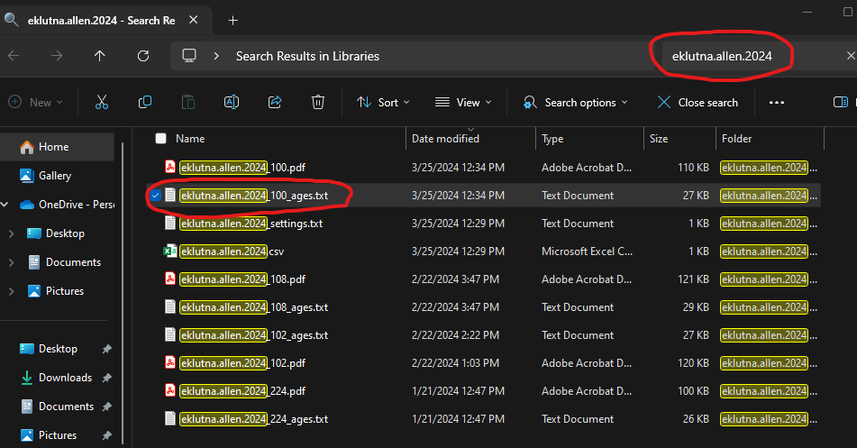
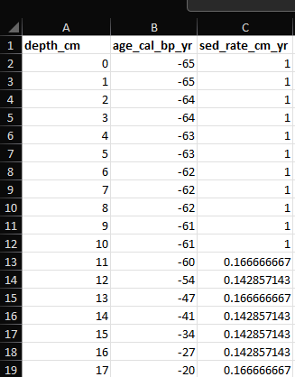

```{r setup, include=FALSE}
knitr::opts_chunk$set(echo = TRUE)
```

```{r setup}
library(paleosedr)
library(readxl)
library(purrr)
library(lipdR)
library(geoChronR)
```

Table of Contents

1\. Standardized Data

2\. LIPD Playground

3\. Age Modeling

4\. **Plotting Sed. Rate and MAR**

5\. Plotting Multi-Proxy Records

6\. Particle Size Heatmap

# 4. Plotting Sed. Rate and MAR

Sed. Rate and MAR are great proxies for understanding the changing
accumulation of sediments within a lake sediment core. These two proxies
can highlight periods of increased or decreased erosion in a watershed.

To set up these plots, we must return to our original Excel file with
our proxy records and gather the data that our age model generates.

Here is the Eklutna dataset that you'll want to use for practice:
<https://docs.google.com/spreadsheets/d/1KlnINNOccssJGl5mrr1PWqobp_kq5WvV/edit?usp=drive_link&ouid=105286369374985387783&rtpof=true&sd=true>

In Windows or Mac, search the title of your age model that you put into
the LipD playground file. For Eklutna, I am searching for the file
"eklutna.allen.2024". You are looking for a file called
"eklutna.allen.2024\_##\_age.txt" This file will only appear if your
age-model was successful.



Once you have located this file, go back to your original Excel file or
grab a fresh one here
(<https://docs.google.com/spreadsheets/d/1IUNLVnXgNeDRKuJ9ysiAO2V2DdnlzheV/edit?usp=drive_link&ouid=105286369374985387783&rtpof=true&sd=true>).

You are going to copy and paste the entire
"eklutna.allen.2024\_##age.txt" age file into the "sed_rate" sheet.
**Delete the three columns circled in red (min, max, mean) and copy the
data from "depth" over to "depth_cm." REMEMBER TO KEEP THE "depth_cm"
COLUMN HEADER AND DO THE SAME FOR MEDIAN AND "age_cal_bp_yr"**

Your Excel sheet should now look like this.
Autofill sed_rate_cm_yr all the way to the bottom of the dataset. You
now have the Sedimentation Rate downcore that you can plot against age
or depth!



Great. Now we will do Mass accumulation rate (MAR). Go to the "bd" sheet
and copy the column "density_gcc." Now go to the "mar" sheet and paste
that column into the density_gcc column of this sheet.

Now go back to the "sed_rate" sheet and copy "depth_cm,"
"sed_rate_cm_yr," and "age_cal_bp_yr." Return to the "mar" sheet and
paste them into their respective columns. In column E, fill it out, and
congrats. You now have MAR.

Save the file, head back to RStudio, and follow this code.

We need to reload the Excel file since we edited it last time.

```{r}
# Replace 'path/to/your/excel_file.xlsx' with the actual file path
excel_file_path <- "C:/Users/allen/OneDrive/Documents/Rstudio/Rstudio/paleosedr/extdata//yyyy.mm.dd_lakename_proxydata.xlsx"

# Call the load_paleo_data function to read in the Excel file
all_data <- load_paleo_data(excel_file_path)
```

Now we can make the sed_rate plot first using the get_sed_rate_sheet
command:

```{r}
eklutna_sed_rate_plot <- get_sed_rate_sheet(all_data)
```

We can also do this for MAR using the get_mar_sheets function:

```{r}
eklutna_mar_plot <- get_mar_sheet(all_data)
```

Both of these plots are ggplots and can be fully edited. If you need to
adjust the plots axis you can substatute you plot name and depths with
the following code. Feel free to also change the color of the geom_line
with whatever you like.

```{r}
eklutna_sed_rate_plot <- 
    scale_x_reverse(
    breaks = c(10000,9500,9000,8500, 8000,7500, 7000,6500, 6000,5500, 5000,4500, 4000,3500, 3000,2500, 2000,1500, 1000,500, 0),
    labels = c("10","","9","", "8","", "7","", "6","", "5","", "4","", "3","", "2","", "1","", "0")) +
  theme_classic()+
  labs(x = "Age (Cal ka bp)", y = "Sed. Rate (cm/yr)")
```


Your final plots should look very similar since Sed. Rate and MAR often
correlate with one another.
